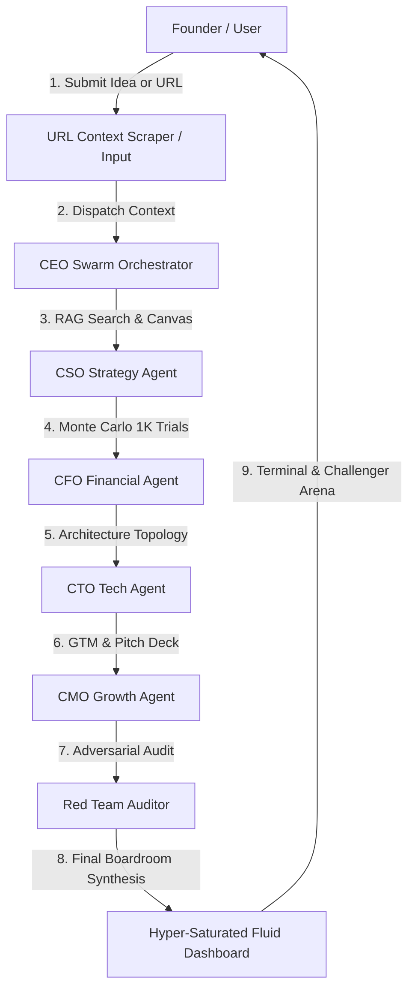

# 🚀 DecisionOS AI: Autonomous Business Operating System (v5.0)

<p align="center">
  
  
  
  
  
</p>

---

## 💡 Overview

**DecisionOS AI** is an advanced, autonomous multi-agent business strategy engine designed to simulate, validate, stress-test, and architect startups and enterprise ventures. 

By deploying a specialized **6-agent C-Suite board** powered by ultra-fast Groq LPU inference and Cohere RAG memory, DecisionOS translates abstract venture concepts or scraped URL content into comprehensive, investor-grade business models, interactive node architectures, stochastic financial simulations, and adversarial security audits.

---

## 🏛️ Autonomous 6-Agent C-Suite Swarm

| Agent Badge | Role | Primary Technical Responsibilities |
| :--- | :--- | :--- |
| 👔 **CEO** | Chief Executive Officer | Orchestrates swarm execution, resolves boardroom debates, and synthesizes final executive viability scores. |
| 🎯 **CSO** | Chief Strategy Officer | Queries market signals via Cohere RAG, constructs 9-box Business Model Canvases, and maps competitive positioning. |
| 📊 **CFO** | Chief Financial Officer | Runs 1,000-trial Monte Carlo stochastic simulations, builds unit economics, and powers the interactive live P&L editor. |
| 🛠️ **CTO** | Chief Technology Officer | Generates interactive 3-tier system architecture topology graphs with cost estimates and node edge vectors. |
| 📣 **CMO** | Chief Marketing Officer | Formulates GTM acquisition tactics, outbound messaging sequences, and constructs interactive VC pitch presentation decks. |
| 🛡️ **Red Team** | Lead Adversarial Auditor | Conducts vulnerability stress-testing, models competitive attack scenarios, and audits human counter-defenses. |

---

## ✨ Key Features & Technical Innovations

### 1. 🌐 Web Context Scraper (URL Ingestion)
Paste any URL (e.g., competitor website or market article). DecisionOS automatically fetches the page, handles GZIP/Brotli encodings, extracts raw DOM text, and feeds the distilled business context directly into the simulation engine.

### 2. 🛠️ Interactive System Architecture Graph (CTO)
Visualizes system topologies in a dynamic, 3-tier node layout (Client → API Gateway → AI & DB Storage). Nodes display real-time infrastructure cost estimates and specifications connected by animated SVG dataflow edges.

### 3. 📊 Live Spreadsheet P&L & Monte Carlo Risk Modeling
Includes an interactive financial P&L table supporting live client-side recalculations (Revenue/OPEX → Net Profit) auto-synced with Chart.js line/bar graphs and CSV export options.

### 4. 🛡️ Red Team Challenger Arena (Human-in-the-Loop)
An interactive security audit module where users submit strategic counter-defenses against identified vulnerability threats, receiving an instant AI-generated numerical audit score (0-100) and verdict.

### 5. 💻 Agent-Aware Terminal Console
A Matrix-inspired terminal allowing founders to chat directly with specific C-Suite agents (`@CEO`, `@CSO`, `@CFO`, `@CTO`, `@CMO`, `@RedTeam`) using the active report context.

### 6. ⚙️ Rate-Limit Resilient Model Router & Admin Portal
Integrated `GroqLLMClient` with exponential backoff retries and multi-model pool rotation (`openai/gpt-oss-20b` ↔ `qwen/qwen3.6-27b` ↔ `allam-2-7b`) to circumvent API rate limits seamlessly. Includes a live Admin Portal for hot-swapping keys and inference models.

---

## ⚙️ Architecture Workflow



---

## 🚀 Quickstart Guide

### Prerequisites
* Python 3.11+
* Groq API Key ([console.groq.com](https://console.groq.com))
* Cohere API Key ([cohere.com](https://cohere.com))

### 1. Clone the Repository
```bash
git clone https://github.com/Alouakhalid/AI-Bussiense-Decision.git
cd AI-Bussiense-Decision
```

### 2. Set Up Virtual Environment & Dependencies
```bash
python3 -m venv venv
source venv/bin/activate
pip install -r requirements.txt
```

### 3. Configure Environment Variables
Create a `.env` file in the root directory:
```ini
GROQ_API_KEY=gsk_your_groq_api_key
COHERE_API_KEY=your_cohere_api_key
GROQ_MODEL_PRIMARY=openai/gpt-oss-20b
GROQ_MODEL_FAST=openai/gpt-oss-20b
API_PORT=8000
API_HOST=0.0.0.0
```

### 4. Launch the Platform
```bash
python3 -m uvicorn app.main:app --host 0.0.0.0 --port 8000 --reload
```
Open your browser and navigate to: **`http://localhost:8000`**

---

## 📂 Repository Structure

```
├── app/
│   ├── agents/             # Autonomous C-Suite Swarm (CEO, CSO, CFO, CTO, CMO, RedTeam)
│   ├── core/               # LLM Client with Retry Pools & Cohere RAG Search Engine
│   ├── models/             # Pydantic Schemas for Business Reports & Node Graphs
│   ├── config.py           # Environment & Hot-Swappable Configuration
│   └── main.py             # FastAPI Server & REST API Endpoints
├── static/
│   ├── css/styles.css      # Hyper-Saturated Fluid Design System & Glassmorphism
│   ├── js/app.js           # Node Graph Engine, Spreadsheet Logic & Terminal
│   └── index.html          # Main Web Application Interface
├── .env                    # Local Configuration (Git Ignored)
├── .gitignore              # Standard Git Ignore Rules
├── README.md               # Documentation
└── requirements.txt        # Python Dependency Requirements
```

---

## 📜 License

This project is open-source under the [MIT License](LICENSE).
